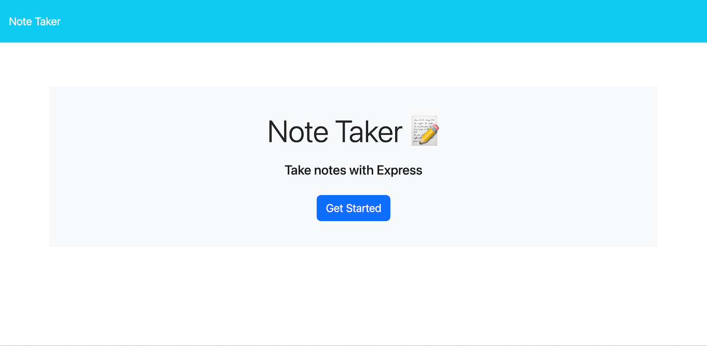
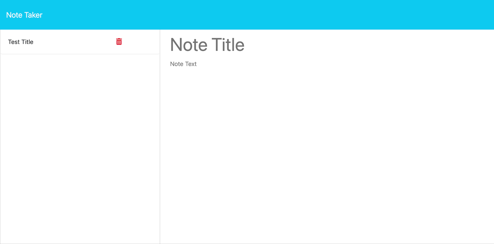

# Note Taker

## Description

This project is a web app that allows users to write and save notes on a backend server. Naturally, note-taking is an important utility that many people use.

The frontend of the app was provided to me as-is, and I implemented the backend. The backend is written in JavaScript to be run in Node.js. Specifically, it uses the Express.js framework to implement the server. The directory `public` contains the frontend code and `server.js` is the contains the main code for the backend. `server.js` depends on `routes/index.js` and thus `routes/notes.js` which contain modular routing for the API path. `routes/notes.js` in turn uses helper functions defined in `helpers/fsHelpers.js` and reads and writes data to `db/db.json`, which is the list of notes that the application displays.

One thing I learned while completing this project was that organizing code into separate files, not just separate functions, can make it easier to manage. `server.js` would be notably longer and harder to understand if I didn't split the functions out into their own files.

## Installation

If you want to run the server locally, you can install this project by cloning the repository from GitHub, then navigating to the project directory in your terminal and running `npm install`.

If you only want to use the app, no installation is needed.

## Usage

To spin up the server locally, use your terminal to navigate to the project directory and run the command `npm start`. The port used by the server will be logged to the command line.

If you have spun up a local instance of the server, navigate in your web browser to `http://localhost:PORT`, where `PORT` is the port being used by the server (3001 by default).

Otherwise, the app is deployed to Heroku and can be accessed by visiting https://safe-fortress-32346-64d3eab7c3c6.herokuapp.com/ in your web browser.

Once you have navigated to the main page of the app, click on the Get Started button to go to the notes page of the app. On the notes page, you can open a note by clicking on its title in the sidebar on the left of the page, write a new note in the area on the right of the page, save a new note by clicking on the Save Note button, or delete an existing note by clicking on the trash icon associated with it in the sidebar on the left.

Here is a screenshot of how the main page of the app should appear:

Here is a screenshot of how the notes page of the app should appear:

## Credits

All modifications to the code were my own. The starter code provided by edX Boot Camps LLC included `package.json` and the contents of `db` and `public`. All other code was written by me.

## License

No license at this time.